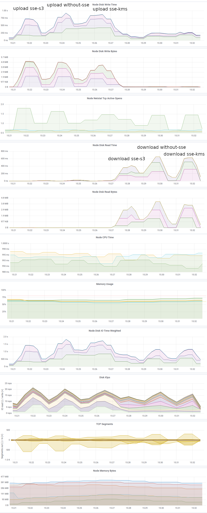

# MinIO BOSH Release

## Server-Side Encryption of Objects

The new job, [KES (MinIO Key Encryption Service)](https://min.io/docs/kes/), now [supports CredHub](https://github.com/minio/kes/pull/413) as a KeyStore, enabling more secure and centralized management of encryption keys. An [example manifest](manifests/manifest-example.yml) is provided for reference.

For detailed information on server-side encryption in MinIO, refer to the [MinIO Server-Side Encryption documentation](https://min.io/docs/minio/linux/administration/server-side-encryption.html).

### Use Cases

Before running the examples below, log in to the MinIO Bosh-release VM:

```shell
$ bosh -d minio-deployment ssh minio/0
$ sudo su - vcap
$ cd /var/vcap/jobs/minio-server/bin
```

You can now manage and check the status of KMS keys:

```shell
# List KMS keys
$ ./mctl admin kms key list THIS_MINIO
┌─────────────────────────────────┐
│ KMS Keys                        │
├─────┬───────────────────────────┤
│ S N │ NAME                      │
├─────┼───────────────────────────┤
│   1 │ MINIO_KMS_KES_DEFAULT_KEY │
└─────┴───────────────────────────┘

# Check the status of a KMS key
$ ./mctl admin kms key status THIS_MINIO
Key: MINIO_KMS_KES_DEFAULT_KEY
- Encryption ✔
- Decryption ✔
```


#### SSE-S3 Encryption

[Server-Side Encryption with S3-managed keys (SSE-S3)](https://min.io/docs/minio/linux/administration/server-side-encryption/server-side-encryption-sse-s3.html)
automatically encrypts and decrypts your MinIO objects on-the-fly using the MinIO Default Key (MINIO_KMS_KES_KEY_NAME) as they are written to or read from the disk.

```shell
# Create a new bucket with SSE-S3 encryption
$ ./mctl mb THIS_MINIO/test-sse-s3
Bucket created successfully `THIS_MINIO/test-sse-s3`.

# Set the default encryption on the bucket to SSE-S3
$ ./mctl encrypt set sse-s3 THIS_MINIO/test-sse-s3
Auto encryption configuration has been set successfully for THIS_MINIO/test-sse-s3

# Verify the encryption status of the bucket
$ ./mctl encrypt info THIS_MINIO/test-sse-s3
Auto encryption 'sse-s3' is enabled
```

#### SSE-KMS Encryption

[Server-Side Encryption with customer-managed keys using KMS (SSE-KMS)](https://min.io/docs/minio/linux/administration/server-side-encryption/server-side-encryption-sse-kms.html)
automatically encrypts and decrypts your MinIO objects on-the-fly using a custom key (you can assign a different key to each bucket) as they are written to or read from the disk.

```shell
# Create a new bucket for SSE-KMS encryption
$ ./mctl mb THIS_MINIO/test-sse-kms
Bucket created successfully `THIS_MINIO/test-sse-kms`.

# Create a new master key for encryption
$ ./mctl admin kms key create THIS_MINIO TEST_SSE_KMS_KEY_1
Created master key `TEST_SSE_KMS_KEY_1` successfully

# List the KMS keys to verify creation
$ ./mctl admin kms key list THIS_MINIO
┌─────────────────────────────────┐
│ KMS Keys                        │
├─────┬───────────────────────────┤
│ S N │ NAME                      │
├─────┼───────────────────────────┤
│   1 │ MINIO_KMS_KES_DEFAULT_KEY │
│   2 │ TEST_SSE_KMS_KEY_1        │
└─────┴───────────────────────────┘

# Set the default encryption on the bucket to use the new KMS key
$ ./mctl encrypt set sse-kms TEST_SSE_KMS_KEY_1 THIS_MINIO/test-sse-kms
Auto encryption configuration has been set successfully for THIS_MINIO/test-sse-kms

# Verify the encryption status and the KeyID used for the bucket
$ ./mctl encrypt info THIS_MINIO/test-sse-kms
Auto encrytion 'sse-kms' is enabled with KeyID: TEST_SSE_KMS_KEY_1
```


#### Mixing Encryption Types During Bucket Lifecycle

It's possible to apply different encryption methods to objects within the same bucket, depending on your security requirements and object lifecycle policies.


```shell
$ ./mctl mb THIS_MINIO/test-sse-mixed
$ echo "test" > /tmp/test.txt
$ ./mctl cp /tmp/test.txt THIS_MINIO/test-sse-mixed/test-without-sse.txt

$ ./mctl encrypt set sse-s3 THIS_MINIO/test-sse-mixed
$ ./mctl cp /tmp/test.txt THIS_MINIO/test-sse-mixed/test-sse-s3.txt

$ ./mctl encrypt set sse-kms TEST_SSE_KMS_KEY_1 THIS_MINIO/test-sse-mixed
$ ./mctl cp /tmp/test.txt THIS_MINIO/test-sse-mixed/test-sse-kms.txt

$ ./mctl ls THIS_MINIO/test-sse-mixed
5B STANDARD test-sse-kms.txt
5B STANDARD test-sse-s3.txt
5B STANDARD test-without-sse.txt
````

Note: When you change the encryption settings of a bucket, it only affects new objects. Existing objects retain their original encryption state unless re-uploaded or copied over with the new encryption settings applied.

```shell
$ ./mctl stat THIS_MINIO/test-sse-mixed/test-without-sse.txt
Name      : test-without-sse.txt
Size      : 5 B    
Type      : file
Metadata  :
Content-Type: text/plain

$ ./mctl stat THIS_MINIO/test-sse-mixed/test-sse-s3.txt
Name      : test-sse-s3.txt
Size      : 5 B    
Type      : file
Encryption: SSE-S3
Metadata  :
Content-Type: text/plain

$ ./mctl stat THIS_MINIO/test-sse-mixed/test-sse-kms.txt
Name      : test-sse-kms.txt
Size      : 5 B    
Type      : file
Encryption: SSE-KMS (arn:aws:kms:TEST_SSE_KMS_KEY_1)
Metadata  :
Content-Type: text/plain 
```


## Additional Points

### Key Rotation

Key rotation in MinIO using a KMS can be performed to enhance security and comply with regulatory requirements.
When you rotate keys, you generate a new cryptographic key for future encryption operations while retaining the old key to decrypt data encrypted with it.

### Versioning and Encryption

When versioning is enabled on a MinIO bucket, each version of an object can be encrypted with a different key. 
This feature allows for greater flexibility and security management, as you can implement key rotation policies and maintain different encryption standards across object versions.

It's important to note that enabling or changing encryption settings on a bucket does not retroactively affect existing versions of objects. 
Instead, the new encryption setting will apply only to new object versions created after the change. 
For instance, if you enable SSE-KMS encryption on a previously unencrypted bucket, only new uploads or updated versions of existing objects will be encrypted with the specified KMS key. 
Previous versions will remain unencrypted unless they are explicitly re-uploaded or copied over with the new encryption settings.

### Performance

Implementing server-side encryption in MinIO can have performance implications due to the additional computational overhead of encrypting and decrypting data on the fly.
The impact largely depends on the chosen method of encryption and the deployment environment. 


#### Create Test Files

The following tests include sample measurement results which, due to the small sample size, are not statistically reliable.

```shell
$ head -c 5M </dev/urandom > /tmp/my-test.file
```

#### Upload Test

```shell
$ time for i in {1..50}; do ./mctl cp /tmp/my-test.file THIS_MINIO/test-sse-s3/my-test-${i}.file; done
real  0m42.761s
user  0m6.185s
sys   0m1.474s

$ time for i in {1..50}; do ./mctl cp /tmp/my-test.file THIS_MINIO/test-without-sse/my-test-${i}.file; done
real  0m53.694s
user  0m6.175s
sys   0m1.523s

$ time for i in {1..50}; do ./mctl cp /tmp/my-test.file THIS_MINIO/test-sse-kms/my-test-${i}.file; done
real  1m0.087s
user  0m6.218s
sys   0m1.420s
```

#### Download Test

```shell
$ time for i in {1..50}; do ./mctl cp THIS_MINIO/test-sse-s3/my-test-${i}.file /tmp/my-test-dwn.file; rm /tmp/my-test-dwn.file; done
real  0m22.607s
user  0m4.081s
sys   0m1.800s

$ time for i in {1..50}; do ./mctl cp THIS_MINIO/test-without-sse/my-test-${i}.file /tmp/my-test-dwn.file; rm /tmp/my-test-dwn.file; done
real  0m26.106s
user  0m3.973s
sys   0m1.742s

$ time for i in {1..50}; do ./mctl cp THIS_MINIO/test-sse-kms/my-test-${i}.file /tmp/my-test-dwn.file; rm /tmp/my-test-dwn.file; done
real  0m26.021s
user  0m4.077s
sys   0m1.771s
```

#### Delete

```shell
$ for i in {1..50}; do ./mctl rm THIS_MINIO/test-sse-s3/my-test-${i}.file; done
$ for i in {1..50}; do ./mctl rm THIS_MINIO/test-without-sse/my-test-${i}.file; done
$ for i in {1..50}; do ./mctl rm THIS_MINIO/test-sse-kms/my-test-${i}.file; done
```
